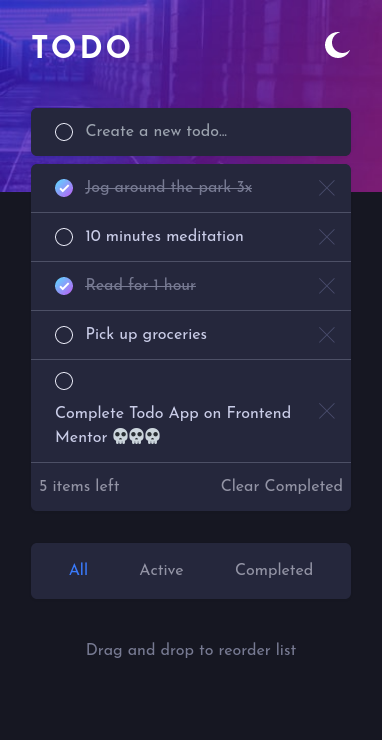

# Frontend Mentor - Todo app solution

This is a solution to the [Todo app challenge on Frontend Mentor](https://www.frontendmentor.io/challenges/todo-app-Su1_KokOW). Frontend Mentor challenges help you improve your coding skills by building realistic projects.

## Table of contents

- [Overview](#overview)
  - [The challenge](#the-challenge)
  - [Screenshot](#screenshot)
  - [Links](#links)
- [My process](#my-process)
  - [Built with](#built-with)
  - [What I learned](#what-i-learned)
  - [Continued development](#continued-development)
  - [Useful resources](#useful-resources)
- [Author](#author)
- [Acknowledgments](#acknowledgments)

**Note: Delete this note and update the table of contents based on what sections you keep.**

## Overview

### The challenge

Users should be able to:

- View the optimal layout for the app depending on their device's screen size
- See hover states for all interactive elements on the page
- Add new todos to the list
- Mark todos as complete
- Delete todos from the list
- Filter by all/active/complete todos
- Clear all completed todos
- Toggle light and dark mode
- **Bonus**: Drag and drop to reorder items on the list

### Screenshot



### Links

- Solution URL: [here](https://github.com/TheMcnafaha/fe-todo)
- Live Site URL: [here](https://fe-todo-ruby.vercel.app/)

## My process

### Built with

- Semantic HTML5 markup
- Drag & Drop API
- Flexbox
- CSS Grid
- Mobile-first workflow
- [Qwik](https://qwik.builder.io/) - TS framework
- [Tailwind](https://tailwindcss.com/) - Tailwind framework

### What I learned

By far, the biggest piece of information that I got from this challenge was using the Drag & Drop (D&D) API. It has some quirks, but if applied porperly, can do things that JS script can match, while retaining mobile support.

Below is the neccesary code (sorry for the regex) to do some "drop-hover" effects using only the D&D API:

```js
(e) => {
              const targetID = (e.target as HTMLElement).id;
              if (prevID.value !== targetID && targetID !== "") {
                if (prevID.value === "") {
                  prevID.value = targetID;
                  const currentE = document.getElementById(targetID);
                  const className = currentE!.classList.value.replace(
                    /bg-\[white\] dark:bg-dark-saturated-blue/,
                    "bg-violet-300 dark:bg-sky-700",
                  );
                  currentE!.classList.value = className;
                  return;
                }
                const oldE = document.getElementById(prevID.value.toString());
                const className = oldE!.classList.value.replace(
                  "bg-violet-300 dark:bg-sky-700",
                  "bg-[white] dark:bg-dark-saturated-blue",
                );
                oldE!.classList.value = className;
                prevID.value = targetID === "" ? prevID.value : targetID;
                const currentE = document.getElementById(targetID);
                const className2 = currentE!.classList.value.replace(
                  /bg-\[white\] dark:bg-dark-saturated-blue/,
                  "bg-violet-300 dark:bg-sky-700",
                );
                currentE!.classList.value = className2;
              }
            }
```

### Continued development

My project is not fully exploring the D&D API. Currently, it has no "cross-window" capabilities.

In the future, I want users to be able to make todos by dragging text into the list from a different window.

### Useful resources

- [MDN's D&D API articles](https://developer.mozilla.org/en-US/docs/Web/API/HTML_Drag_and_Drop_API) - I would have not been able to accomplist this project without these articles.

## Author

- Frontend Mentor - [@yourusername](https://www.frontendmentor.io/profile/yourusername)
